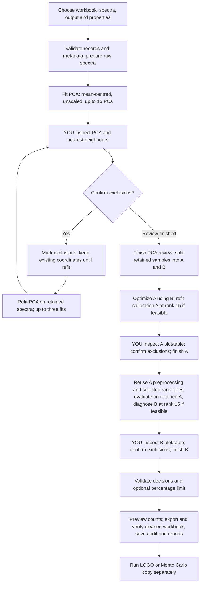

# MIR Cleanup desktop workflow

This chart describes the staged desktop app. The command-line `analyse` command remains a legacy workflow that calculates both halves before manual review.

- A/B splitting uses sample-average PCA scores and deterministic Kennard–Stone selection. Replicates remain together.
- Metadata supplies response transformation, units and CO₂ exclusion. Sheet values stay untransformed.
- No point selection or numerical candidate removes data without confirmation.
- Calibration decisions remove either individual spectra or whole samples within a property, as chosen by the user. The percentage limit defaults to disabled; its enabled percentage is editable.
- Calibration plots and tables use the same diagnostic rank; marking exclusions does not refit that half.
- Changed PCA decisions invalidate downstream results. Changed A decisions invalidate B's model and confirmations.
- Saved sessions support resume and source relocation with fingerprint validation. Existing legacy reviews are preserved.
- Exports do not overwrite existing workbooks. The offline PCA viewer uses a labelled basis; hiding points is not refitting PCA.

See `MAC_APP_GUIDE.md` for controls, interpretation and first-release boundaries.
